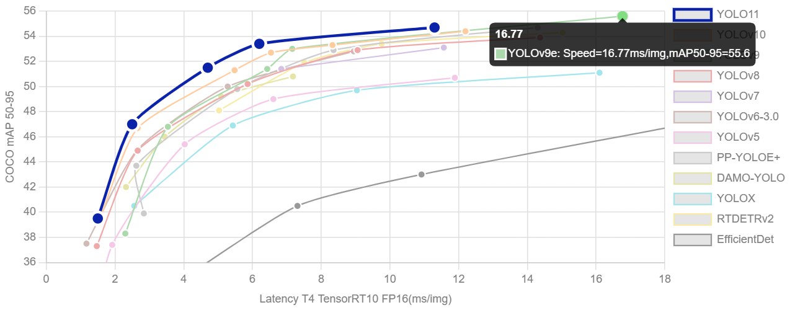

# H&E 통합 cell detection

담당자: 영섭 이
진행 상태: 진행 중
프로젝트: H&E 레벨 바이오마커 AI (https://www.notion.so/H-E-AI-26142971c02f8019860cefd1752d89d3?pvs=21)
git repositories: https://github.com/Leeyoungsup/HnE_cell_detection

# DataSet

### Lizard Dataset

- **Task 목적:** 세포(instance) 단위 **nucleus + cytoplasm 동시 segmentation**
- **Annotation 특징:** **핵-세포질 1:1 연결 구조**, instance-level polygon mask
- **데이터 특징:**
    - 총 **291장의 High-Resolution 현미경 이미지**
    - **10× / 20× / 40× 다배율 (multi-scale)**
    - **multi-organ + multi-center (4개 병원)**
- **연구 난이도:** 단순 nucleus segmentation보다 **현실 병리학에 훨씬 근접한 난제 데이터**
- **모델 벤치마크에 적합:** HoverNet, CellPose, SAM fine-tuning 등에 **표준 평가셋**
- **실제 활용 가능성:**
    - 세포 수 기반 **density 분석**,
    - **CPS/TPS 자동점수화 연구** 등 **clinical-grade cell-level 분석에 최적화**

# Model

- 검출 모델 YOLOv11 사용
- 커스텀을 위하여 모델구조와 loss 만 사용하여  전체 running 코드 구축
- 관련 링크
-[https://docs.ultralytics.com/ko/models/yolo11/](https://docs.ultralytics.com/ko/models/yolo11/)
-[https://github.com/Leeyoungsup/HnE_cell_detection](https://github.com/Leeyoungsup/HnE_cell_detection)

# Training (학습 진행중)

- 커스텀을 위하여 모델구조와 loss 만 사용하여  전체 running 코드 구축

# WSI level analysis

- 오픈데이터 셋인 Lizard dataset으로 진행하였기 때문에 external Data도 20x로 진행
- 40x 배율의 WSI 이미지를 1024,1024패치화 하여 512로 리사이즈하여 세포 검출 (20x)

